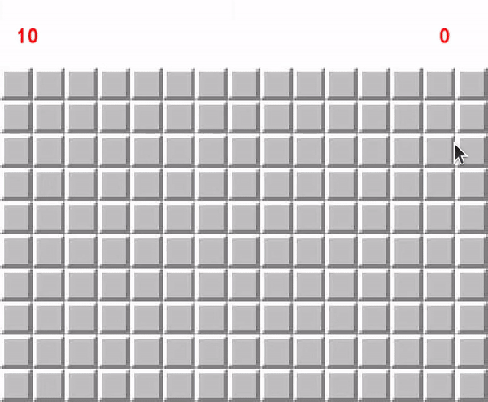

# A Minesweeper clone in C++ with SFML

This is my Minesweeper game made to learn basics of C++. Also I'm studying Hebrew right now, that is why numbers are replaced with Hebrew letters.
Game can be run in 2 modes: standalone and client-server.
# 

## Building

The only dependency is [SFML](https://www.sfml-dev.org). On Ubuntu it can be installed with:
```
sudo apt install libsfml-dev
```

To build and run the game use:
```
make

# to run single player
# preset can be {1, 2, 3} - it is game difficult
./build/standalone preset

# to run server (ip is hardcoded to 0.0.0.0)
./build/server port
# to run client
./build/client host_ip port client_name
```

## License

MIT License
